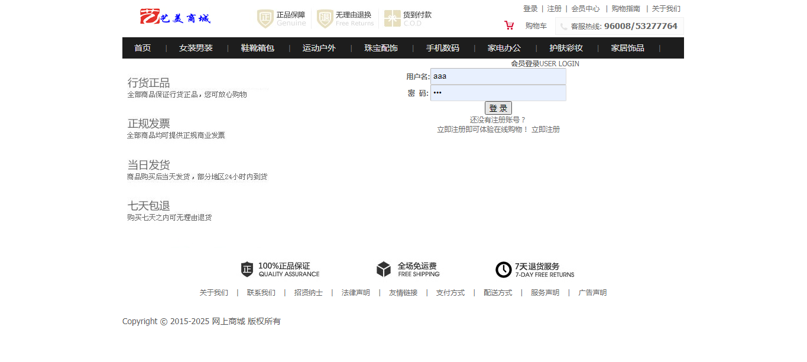
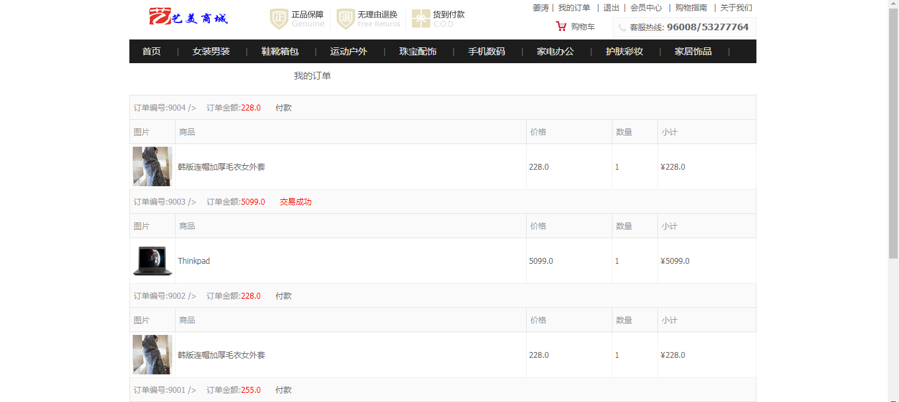
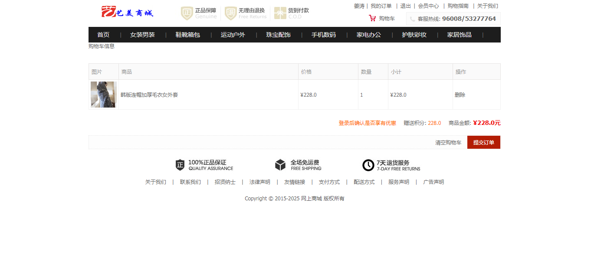
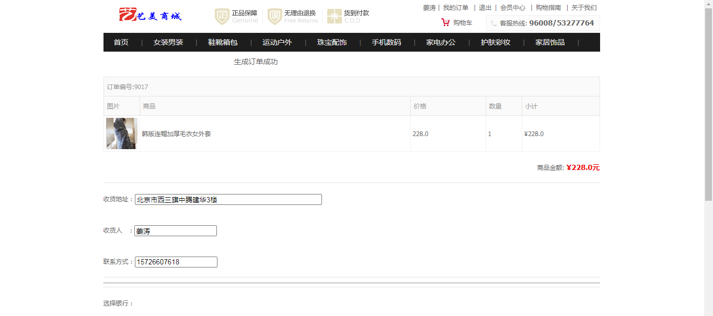
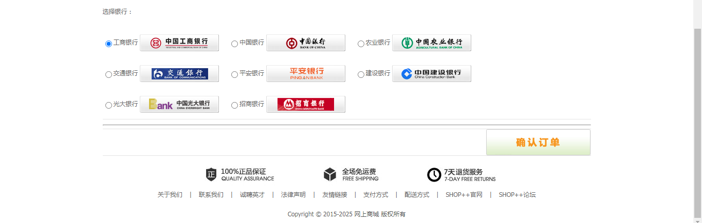
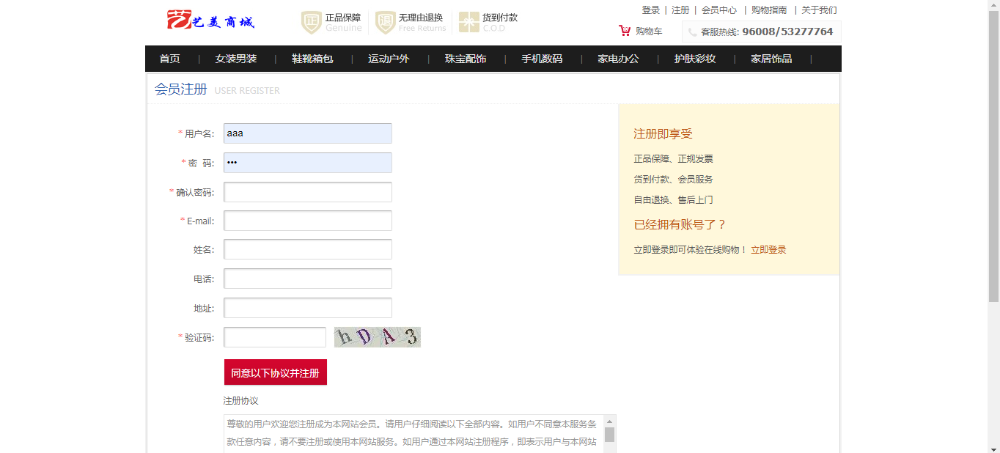
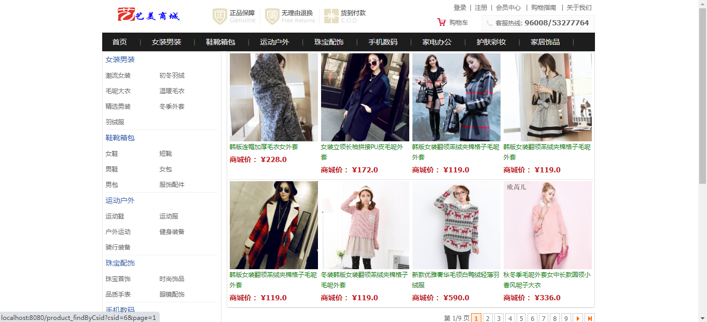

<h1 align="center">网上购物商城管理系统</h1>

## 简介
网上购物商城管理系统：角色分为管理员、用户；包含订单管理、商品浏览、购物车、支付选择、用户注册和账户管理等功能，提供便捷的在线购物体验和全面的售后服务支持。    --计算机毕业设计源码；毕设源码；java毕业设计源码

## 联系方式

<h3 align="center">获取完整代码与数据库文件 + 微信：deepguan QQ: 86050149 QQ群: 783742310</h3>

<h3 align="center">可帮忙远程部署 包运行成功！提供远程部署、修改代码、设计文档指导、代码讲解等服务！</h3>

## 功能介绍（完整见运行截图）
管理员： 主要功能包括用户管理、商品管理、订单管理和系统维护。可以查看和处理订单详情，更新商品信息和库存，并管理用户账号。提供统计和分析工具以帮助优化商城运营。具备权限设定功能和系统安全监控，确保商城安全。

用户： 可在商城完成注册登录，访问主页上的导航栏和商品分类。用户可以搜索商品、查看商品图片和详情、加入购物车并进行结算。通过查看订单和更新用户个人信息管理账户。支持查看购物历史、复制地址、联系客户服务等，以提升购物体验。

## 运行截图

本代码来源于网络,仅供学习参考使用!

